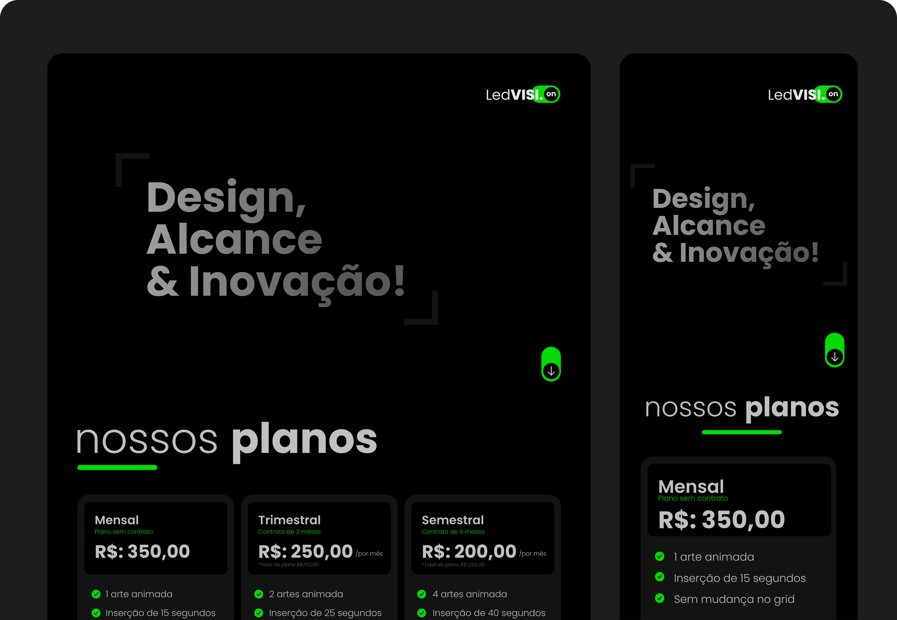

# LedVision - Apresentação de Planos
Neste projeto pude codificar a página de apresentação de planos e aplicar algumas abordagens práticas como **mobile first**, **perfect pixel** e **design responsivo**.

## Landing Page - Preview

- Resultado - **[LedVision](https://mateusdmc.github.io/LedVision/)**

## Features
O desenvolvimento deste projeto foi realizado com as seguintes ferramentas e tecnologias:
- **HTML5**: Estruturação semântica do conteúdo.
- **CSS**: Estilização e apresentação visual.
- **JavaScript**: Implementação da lógica interativa e dinâmica do projeto.
- **Tailwind CSS**: Framework utilitário para um desenvolvimento de design rápido e responsivo.
- **Node/NPM**: Gerenciamento de dependências e automação de tarefas do projeto.
